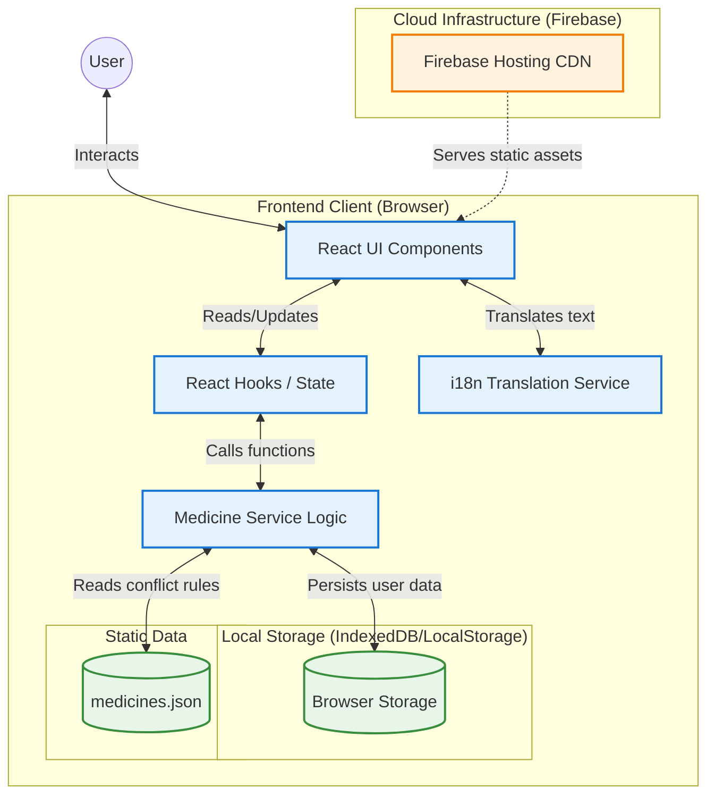
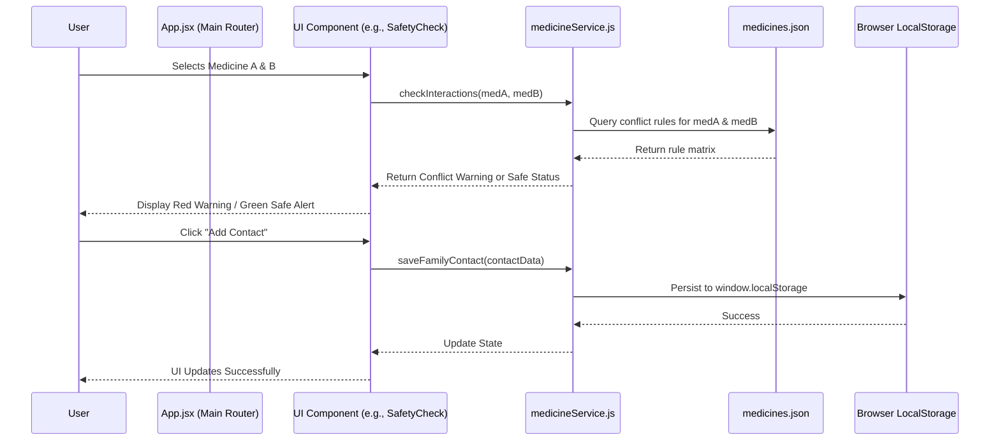
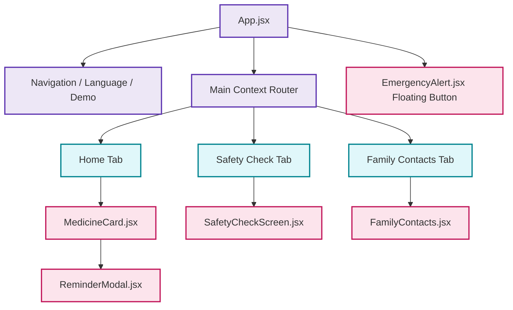

# 🏗️ Medicine Safety Net: Architecture & Technical Documentation

This document provides a high-level overview of the system architecture, component interactions, and data flow of the Medicine Safety Net application.

---

## 1. High-Level System Architecture

The application is designed as an **Offline-First Single Page Application (SPA)**. It relies heavily on client-side processing to ensure it remains functional without an active internet connection, storing critical safety data locally in the browser.

> [!NOTE] 
> Because the application handles critical health data, executing the conflict analysis locally ensures **zero latency** and **100% privacy** (medical data is never sent to a backend server).

---

## 2. Component Interaction & Data Flow

This diagram illustrates how data flows when a user interacts with the app (e.g., adding a medicine or running a safety check).

---

## 3. Technical Stack Breakdown

### Frontend Framework
*   **Library:** React 18
*   **Build Tool:** Vite (chosen for sub-second Hot Module Replacement and highly optimized Rollup production builds).
*   **Styling:** Vanilla CSS3 with CSS Variables for dynamic theming (Dark Mode/Light Mode).

### Core Services (`src/services/`)
*   **`medicineService.js`**: The core business logic engine. It exposes pure functions for analyzing cross-reactions between drugs, checking food conflicts, and managing the `localStorage` state for reminders and emergency contacts.
*   **`i18n.js`**: A custom localization engine. It exports dictionaries for multiple Indian languages (English, Hindi, Marathi, Gujarati, Tamil) and manages language state switching globally across the UI.
*   **`firebase.js`**: Initializes the Firebase SDK. Currently used minimally for potential future backend extensions.

### Static Database (`src/data/`)
*   **`medicines.json`**: Acts as a static, NoSQL-style document database. 
    *   Contains an array of 54 common medicines.
    *   Each medicine object contains nested schemas for `interactions`, `food_conflicts`, `dosages`, and localized `side_effects`.

### Deployment Pipeline
*   **Platform:** Firebase Hosting
*   **Methodology:** Custom REST API orchestration script using Google Cloud IAM Service Accounts to sign OAuth 2.0 JWTs.
*   **Optimization:** Aggressive `zlib` GZIP compression at level 9, strict SHA-256 asset hashing for cache-busting, and strict HTTP `Cache-Control` headers on entry files (`index.html`).

---

## 4. UI Component Hierarchy

---

## 5. Security & Privacy Posture

> [!IMPORTANT]
> The Medicine Safety Net is built on a "Privacy by Design" philosophy.

1.  **No Server-Side Tracking:** User actions, medical queries, and emergency contacts are processed exclusively within the user's local browser memory.
2.  **No Authentication Required:** Users can instantly access life-saving information without the friction of creating an account or handing over an email address.
3.  **Local Storage Sanitization:** Inputs for custom symptoms or emergency contacts are sanitized before rendering to prevent Cross-Site Scripting (XSS) attacks.
